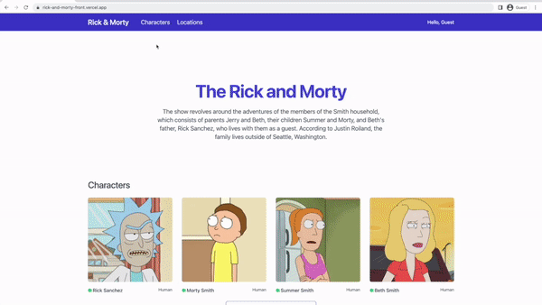

# Rick & Morty Project

## Getting started

### [Live Demo](https://rick-and-morty-front.vercel.app/)


<br />

### Project Details

- [React](https://reactjs.org/)
- [Nextjs](https://nextjs.org/) for Server-Side Rendering(SSR) & Static Site Generation(SSG) & Incremental Static Regeneration(ISR)
- [Typescript](https://www.typescriptlang.org/) for check syntax & safety at scale project
- [React Query](https://tanstack.com/query/v4) for state management for API calls (end points)
- [Jotai](https://jotai.org/) for state management
- [Tailwind CSS](https://tailwindcss.com/) for styles manage

<br />

**General functionality:**

- Display list of characters
- Display list of locations
- Display details of character & display list of episodes
- Display details of location & display list of residents
- Filter characters by name and gender
- Filter locations  by name
- Save favorite character in cookie storage

<br />

### install packages and run project in local:

```bash
npm install

npm run dev
```

then open [http://localhost:3000](http://localhost:3000) with your browser to see the result.
